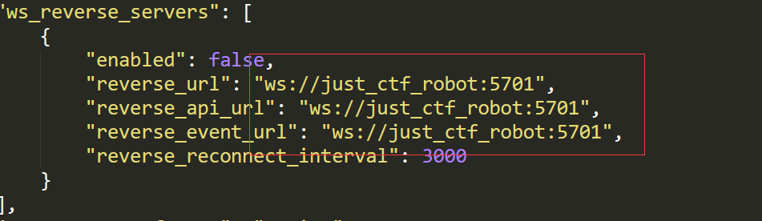
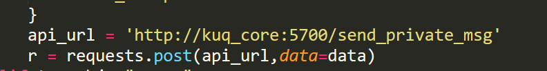
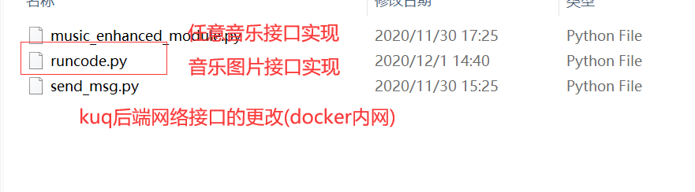
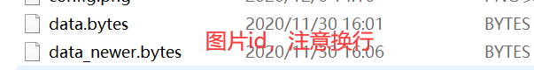

# 第一次新生赛&信息安全协会机器人(Hex)

> 说明:
> 机器人核心代码分别引用自南邮机器人和酷Q中间件

### 基于原项目所作的内容优化

​	**1. 基于docker内网做了网络接口相关的更改**

在如上填入内网机器名

注意hex的源码也要修改

​	**2. 为Hex添加的相关接口实现**

​	**3. 图片接口(pixiv.cat)的相关图片数据(为保证质量手爬图片id)**

